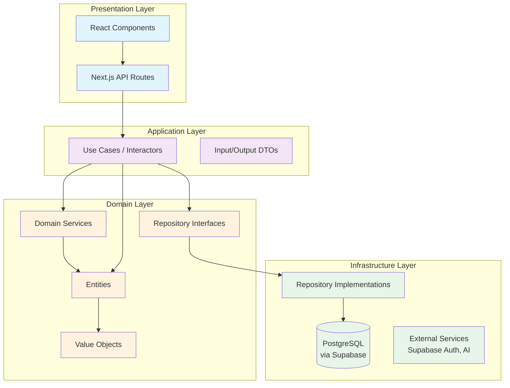
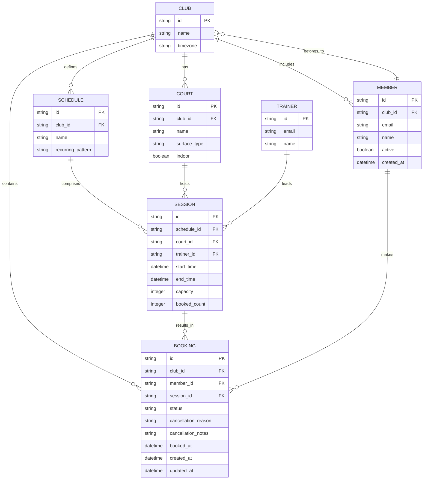
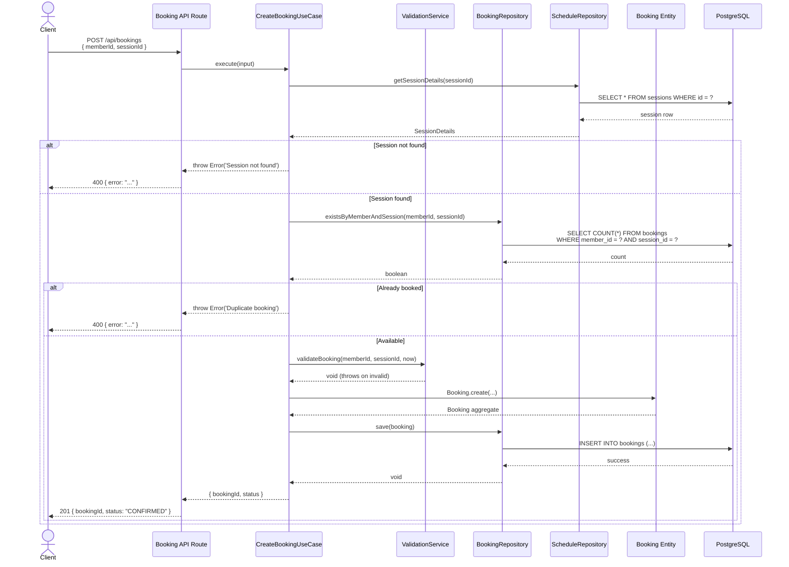

# SWINGZ Architecture

## 📋 Overview

SWINGZ follows **Clean Architecture** combined with **Domain-Driven Design (DDD)** principles. This document provides a comprehensive overview of the system's architecture, design decisions, and component interactions.

---

## 🏗 High-Level Architecture



**Key Principle:**

- **Dependency Rule**: Outer layers depend on inner layers via interfaces, never vice versa
- **Domain-Centric**: Business logic lives in Domain & Application layers; Infrastructure is a plugin
- **Independence**: Domain layer has zero dependencies on frameworks, databases, or UI

---

## 📦 Layer Breakdown

### 1. Presentation Layer

**Location**: `app/`, `components/`, `lib/`

Responsible for:

- HTTP request/response handling (Next.js API Routes)
- UI rendering (React Server & Client Components)
- Input validation (Zod schemas)
- Authentication middleware (Supabase Auth Helpers)

**Technology**:

- Next.js 15 App Router (Server Components by default)
- React 18 with Client Components for interactivity
- shadcn/ui + Tailwind CSS for design system
- TanStack Query for server state management

**Constraints**:

- May only call Application layer (Use Cases)
- Should not contain business logic
- Transforms Use Case outputs into UI state

---

### 2. Application Layer

**Location**: `src/application/`

Responsible for:

- Orchestration of business workflows (Use Cases / Interactors)
- Input validation & output transformation (DTOs)
- Transaction coordination
- Crossing domain boundaries

**Key Components**:

- **Use Cases**: One class per business operation (`CreateBookingUseCase`, `CancelBookingUseCase`, `GetClubAnalyticsUseCase`)
- **Input/Output Models**: Type-safe DTOs (`CreateBookingInput`, `GetMemberBookingsOutput`)
- **Domain Services**: Invoked by Use Cases (`ValidationService`, `BookingStatusMachine`)

**Constraints**:

- Depends only on Domain layer (repository interfaces, entities, value objects)
- No infrastructure details (no SQL, no HTTP clients)
- Pure TypeScript, no framework dependencies

---

### 3. Domain Layer

**Location**: `src/domain/`

Heart of the system. Contains:

- **Entities**: Business objects with identity and lifecycle (`Booking`, `Member`, `Club`, `Court`, `Schedule`, `Session`)
- **Value Objects**: Immutable, self-validating types (`MemberId`, `Email`, `TimeSlot`, `BookingId`)
- **Repository Interfaces**: Ports for persistence abstraction (`BookingRepository`, `MemberRepository`)
- **Domain Services**: Stateless business logic not naturally belonging to an entity (`ValidationService`, `BookingStatusMachine`)

**DDD Concepts**:

- **Aggregates**: `Booking` (root), `Club` (root) – enforce invariants within aggregate boundary
- **Bounded Contexts**: `BookingContext`, `MemberContext`, `AnalyticsContext` (implicit in layer separation)
- **Ubiquitous Language**: Terms like "Session", "Schedule", "Court", "Booking" are consistent across code & docs

**Constraints**:

- Zero external dependencies (no DB, no HTTP, no frameworks)
- 100% testable without mocks (pure TypeScript)
- All business rules enforced at entity/aggregate level

---

### 4. Infrastructure Layer

**Location**: `src/infrastructure/`

Responsible for:

- **Persistence**: Drizzle ORM repository implementations (`booking.repository.ts`)
- **External APIs**: Supabase client factory (`supabase/server.ts`)
- **Schema Definitions**: Drizzle table schemas (`schema/`)

**Key Components**:

- **Repositories**: Implement domain repository interfaces using Drizzle ORM
- **Supabase Client**: SSR-ready client with session handling
- **Drizzle Client**: Type-safe Postgres connection

**Constraints**:

- Implements interfaces defined in Domain layer
- Contains all framework-specific code (Drizzle, Supabase SDK)
- Can be swapped without affecting Domain/Application

---

## 🧩 Domain Model

### Aggregates & Entities



### Value Objects

All Value Objects (VOs) are **immutable** and **self-validating** upon construction:

| Value Object                                   | Validation Rule       | Example                                  |
| ---------------------------------------------- | --------------------- | ---------------------------------------- |
| `MemberId`                                     | UUID v4 format        | `"a1b2c3d4-e5f6-7890-abcd-ef1234567890"` |
| `SessionId`                                    | UUID v4 format        | `"b2c3d4e5-f6a7-8901-bcde-f23456789012"` |
| `BookingId`                                    | UUID v4 format        | `"c3d4e5f6-a7b8-9012-cdef-345678901234"` |
| `Email`                                        | RFC 5322 regex        | `"user@example.com"`                     |
| `TimeSlot`                                     | `start < end`, max 4h | `{ start: 14:00, end: 15:00 }`           |
| `CourtId`, `ClubId`, `ScheduleId`, `TrainerId` | UUID v4               | —                                        |

**Immutability Guarantee**:

```typescript
const vo = Email.fromString('test@example.com');
vo.value = 'hacked@example.com'; // ❌ TypeScript error: readonly
```

---

## 🔄 Data Flow: Create Booking Use Case



**Key Points**:

1. API Route receives HTTP request → delegates to Use Case
2. Use Case queries dependencies (repositories) via interfaces
3. Double-booking check happens **before** INSERT (application layer)
4. Database has **unique constraint** as safety net (defense in depth)
5. Error messages are user-friendly but also logged server-side

---

## 🗄 Database Schema

### Tables Overview

| Table                   | Purpose                                 | Key Constraints                                                                             |
| ----------------------- | --------------------------------------- | ------------------------------------------------------------------------------------------- |
| `clubs`                 | Tennis clubs (multi-tenant root)        | PK `id`                                                                                     |
| `courts`                | Courts belonging to a club              | FK `club_id` → `clubs`                                                                      |
| `trainers`              | Trainer profiles (linked to auth users) | PK `id`, unique `email`                                                                     |
| `schedules`             | Recurring schedule templates            | FK `club_id`                                                                                |
| `sessions`              | Concrete session instances              | FK `schedule_id`, `court_id`, `trainer_id`; unique on `(court_id, start_time, end_time)`    |
| `members`               | Club members (linked to auth users)     | FK `club_id`; unique `(club_id, email)`                                                     |
| `bookings`              | Booking aggregates (root)               | FK `member_id`, `session_id`; **UNIQUE `(member_id, session_id)`** prevents double bookings |
| `user_club_memberships` | Auth user ↔ club mapping                | PK `(user_id, club_id)`                                                                     |

### Indexes for Performance

```sql
-- bookings: fast lookup by member & session
CREATE UNIQUE INDEX idx_bookings_member_session ON bookings(member_id, session_id);

-- sessions: filter by schedule & time range
CREATE INDEX idx_sessions_schedule_time ON sessions(schedule_id, start_time);

-- members: club-based queries
CREATE INDEX idx_members_club_active ON members(club_id, active);

-- sessions: court availability checks
CREATE INDEX idx_sessions_court_time ON sessions(court_id, start_time, end_time);
```

### Row Level Security (RLS)

All tables use **RLS policies**:

- `members`: Users can only read/write their own club's members (admin role check)
- `bookings`: Members can only see their own bookings; admins see all in their club
- `sessions`: Public read within club; write only for admins/trainers

---

## 🔐 Authentication & Authorization

### Current State

- **Auth Provider**: Supabase Auth (not yet fully integrated)
- **Current**: Demo user hardcoded in `app/(protected)/layout.tsx` (lines 8-11)
- **Goal**: Replace with real Supabase Auth session lookup

### Planned Integration

```typescript
// app/(protected)/layout.tsx (planned)
import { createClient } from '@/infrastructure/external/supabase/server';

export default async function ProtectedLayout({ children }: { children: React.ReactNode }) {
  const supabase = createClient();
  const { data: { user } } = await supabase.auth.getUser();

  if (!user) {
    redirect('/login');
  }

  // Fetch member profile linked to user
  const { data: member } = await supabase
    .from('members')
    .select('*, clubs(*)')
    .eq('auth_user_id', user.id)
    .single();

  return (
    <ProtectedRoute user={user} member={member}>
      {/* ... */}
    </ProtectedRoute>
  );
}
```

### Authorization Model

- **Admin Role**: Determined by `user_club_memberships.role = 'admin'`
- **Member Role**: Default role for all club memberships
- **Trainer Role**: Present in `trainers` table + `user_club_memberships.role = 'trainer'`

---

## 🧠 Domain Layer Deep Dive

### Booking Aggregate

**Invariants** (enforced by `Booking` entity):

1. A booking can only be created for a future session
2. A member cannot book the same session twice (unique constraint + check in `Booking.create()`)
3. Booking status transitions follow state machine: `CONFIRMED` → `CANCELLED` or `COMPLETED`
4. Cancellation requires a valid `CancellationReason`

**State Machine** (`BookingStatusMachine`):

```typescript
CONFIRMED → CANCELLED (with reason)
CONFIRMED → COMPLETED (after session end)
CANCELLED → (no transitions)
COMPLETED → (no transitions)
```

### Member Entity

- Belongs to exactly one `Club` at a time (multi-club membership via `user_club_memberships`)
- Has `active` flag – inactive members cannot create bookings
- Email must be unique within club

### Session Entity

- Tracks `booked_count` denormalized for quick capacity checks
- Triggers `onBookingConfirmed` event (future: notifications)
- Capacity check: `booked_count < session.capacity`

---

## 🔄 Dependency Injection

### Current State

- **tsyringe** is installed but **not used**
- Manual instantiation everywhere (see `app/api/bookings/route.ts`)

### Planned Integration

```typescript
// src/application/container.ts
import { container } from 'tsyringe';
import { DrizzleBookingRepository } from '@/infrastructure/persistence/repositories/booking.repository';
import { BookingRepository } from '@/domain/repositories/booking-repository.interface';
import { CreateBookingUseCase } from '@/application/use-cases/booking.use-cases';

container.register(BookingRepository, { useClass: DrizzleBookingRepository });
container.register(CreateBookingUseCase);

// In API route:
const createBooking = container.resolve(CreateBookingUseCase);
```

**Benefits**:

- Centralized configuration
- Easy mocking for tests
- Clear dependency graph
- Loose coupling

---

## ✅ Quality Standards

### Type Safety

- **TypeScript strict mode** enabled (`tsconfig.json`)
- No `any` types allowed (enforced by ESLint rule `@typescript-eslint/no-explicit-any`)
- All DTOs use explicit types, no `Record<string, any>`

### Error Handling

- **Planned**: Custom domain error classes (`BookingError`, `MemberNotFoundError`, `SessionFullError`, `ClubNotFoundError`)
- Currently: Generic `Error` thrown (critique issue #4)

### Testing

- **Framework**: Vitest + Testing Library
- **Coverage Target**: >80% (current: ~45%)
- **Unit Tests**: Use Cases, Domain Services, Value Objects
- **Integration Tests**: API Routes with Test DB (Docker)
- **E2E Tests**: Playwright (booking flow, admin toggle)

### Linting & Formatting

```bash
npm run lint        # ESLint
npm run lint:fix    # Auto-fix
npm run format      # Prettier
npm run typecheck   # TypeScript compiler (noEmit)
npm run test        # Unit + Integration
npm run test:e2e    # E2E (Playwright)
npm run build       # Production build
```

---

## 🚀 Deployment

### CI/CD (GitHub Actions)

```yaml
on: [push, pull_request]
jobs:
  lint: npm run lint
  typecheck: npm run typecheck
  test: npm run test -- --coverage
  build: npm run build
```

### Vercel

- Automatic deployments from `main` branch
- Preview deployments for PRs
- Environment variables configured in Vercel dashboard
- Edge Functions for API routes (optional)

---

## 📊 Metrics & Monitoring

- **Sentry**: Error tracking & performance monitoring (`NEXT_PUBLIC_SENTRY_DSN`)
- **Google Analytics** (optional): `NEXT_PUBLIC_ENABLE_ANALYTICS`
- **Custom Logger**: `lib/logger.ts` with levels (debug, info, warn, error)

---

## 🔮 Future Improvements

1. **Event Sourcing** for Booking lifecycle (audit trail)
2. **CQRS** with separate read models (materialized views for analytics)
3. **Realtime Updates** via Supabase Realtime (booking confirmations)
4. **Queue** (BullMQ) for async jobs (email notifications, analytics batch)
5. **Multi-tenancy**: Row-level isolation via `club_id` in every table (already implemented)
6. **Caching Layer**: Redis for session/court availability cache

---

## 📚 References

- [Clean Architecture](https://www.oreilly.com/library/view/clean-architecture/9780134494272/) by Robert C. Martin
- [Domain-Driven Design](https://www.domainlanguage.com/) by Eric Evans
- [Next.js Docs](https://nextjs.org/docs)
- [Supabase Docs](https://supabase.com/docs)
- [Drizzle ORM Docs](https://orm.drizzle.team/)
- [TanStack Query Docs](https://tanstack.com/query/)

---

**Last Updated**: 2026-04-29
**Maintainers**: SWINGZ Dev Team
