# SwingZ — Workflows & System-Architektur

> **Wie die 4 Kernfunktionen zusammenwirken und was im System genau passiert, wenn ein Member eine Stunde bucht, eine Saison veröffentlicht wird, Rechnungen generiert werden etc.**

---

## 📊 Überblick: Die 4 Kernfunktionen & ihre Verbindungen

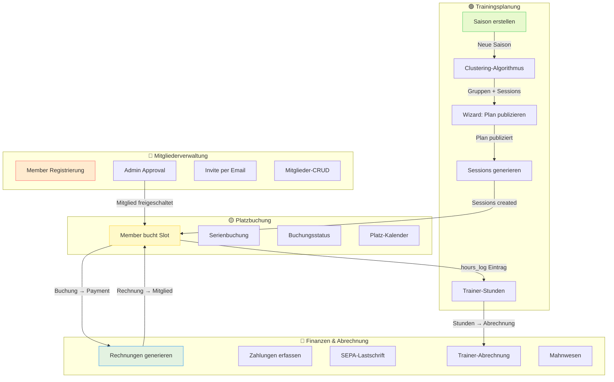
```mermaid
graph TB
    subgraph "🔴 Mitgliederverwaltung"
        M1["Member Registrierung"]
        M2["Admin Approval"]
        M3["Invite per Email"]
        M4["Mitglieder-CRUD"]
    end

    subgraph "🟢 Trainingsplanung"
        T1["Saison erstellen"]
        T2["Clustering-Algorithmus"]
        T3["Wizard: Plan publizieren"]
        T4["Sessions generieren"]
        T5["Trainer-Stunden"]
    end

    subgraph "🟡 Platzbuchung"
        B1["Member bucht Slot"]
        B2["Serienbuchung"]
        B3["Buchungsstatus"]
        B4["Platz-Kalender"]
    end

    subgraph "🔵 Finanzen & Abrechnung"
        F1["Rechnungen generieren"]
        F2["Zahlungen erfassen"]
        F3["SEPA-Lastschrift"]
        F4["Trainer-Abrechnung"]
        F5["Mahnwesen"]
    end

    M2 -->|"Mitglied freigeschaltet"| B1
    T4 -->|"Sessions created"| B1
    B1 -->|"hours_log Eintrag"| T5
    T5 -->|"Stunden → Abrechnung"| F4
    B1 -->|"Buchung → Payment"| F1
    F1 -->|"Rechnung → Mitglied"| B1
    T1 -->|"Neue Saison"| T2
    T2 -->|"Gruppen + Sessions"| T3
    T3 -->|"Plan publiziert"| T4

    style M1 fill:#ff6b6b22,stroke:#ff6b6b
    style T1 fill:#51cf6622,stroke:#51cf66
    style B1 fill:#ffd43b22,stroke:#ffd43b
    style F1 fill:#339af022,stroke:#339af0
```

---

## 🔁 Workflow 1: Member registriert sich & bucht eine Stunde

### 1a. Registrierung & Freischaltung

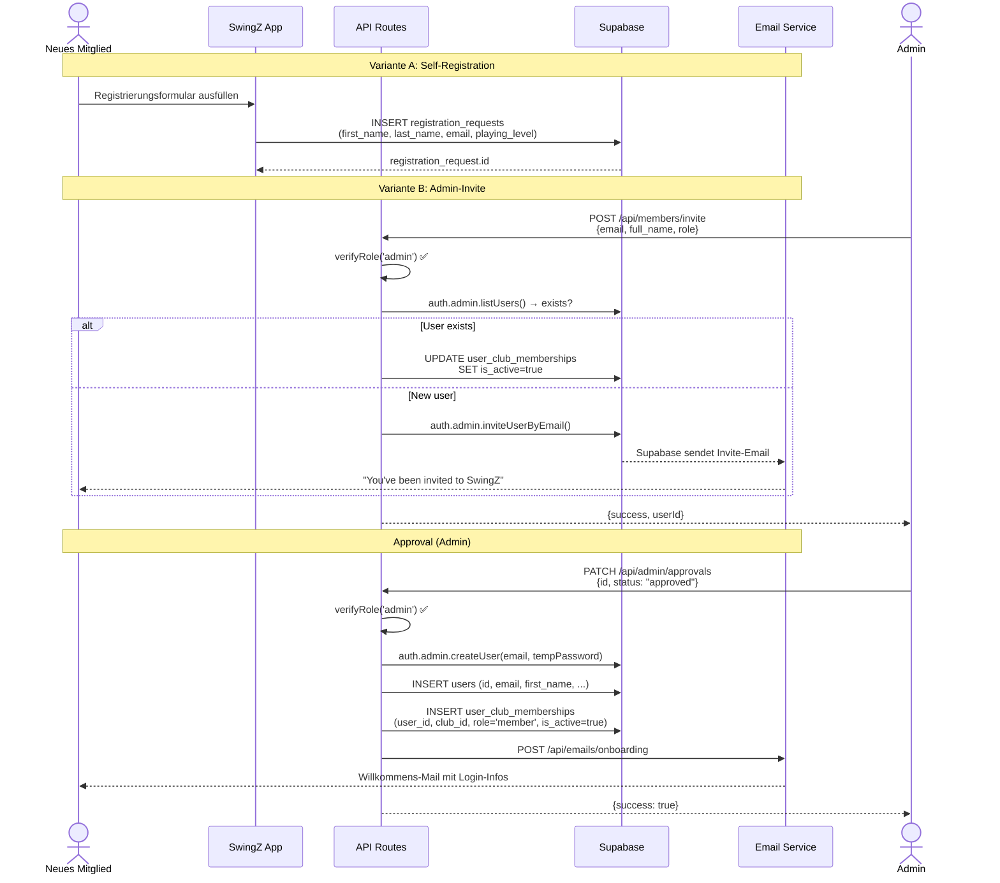
```mermaid
sequenceDiagram
    actor User as Neues Mitglied
    participant App as SwingZ App
    participant API as API Routes
    participant DB as Supabase
    participant Mail as Email Service

    Note over User,Mail: Variante A: Self-Registration
    User->>App: Registrierungsformular ausfüllen
    App->>DB: INSERT registration_requests<br/>(first_name, last_name, email, playing_level)
    DB-->>App: registration_request.id

    Note over User,Mail: Variante B: Admin-Invite
    actor Admin
    Admin->>API: POST /api/members/invite<br/>{email, full_name, role}
    API->>API: verifyRole('admin') ✅
    API->>DB: auth.admin.listUsers() → exists?
    alt User exists
        API->>DB: UPDATE user_club_memberships<br/>SET is_active=true
    else New user
        API->>DB: auth.admin.inviteUserByEmail()
        DB-->>Mail: Supabase sendet Invite-Email
        Mail-->>User: "You've been invited to SwingZ"
    end
    API-->>Admin: {success, userId}

    Note over User,Mail: Approval (Admin)
    Admin->>API: PATCH /api/admin/approvals<br/>{id, status: "approved"}
    API->>API: verifyRole('admin') ✅
    API->>DB: auth.admin.createUser(email, tempPassword)
    API->>DB: INSERT users (id, email, first_name, ...)
    API->>DB: INSERT user_club_memberships<br/>(user_id, club_id, role='member', is_active=true)
    API->>Mail: POST /api/emails/onboarding
    Mail-->>User: Willkommens-Mail mit Login-Infos
    API-->>Admin: {success: true}
```

### 1b. Member bucht eine Trainingsstunde

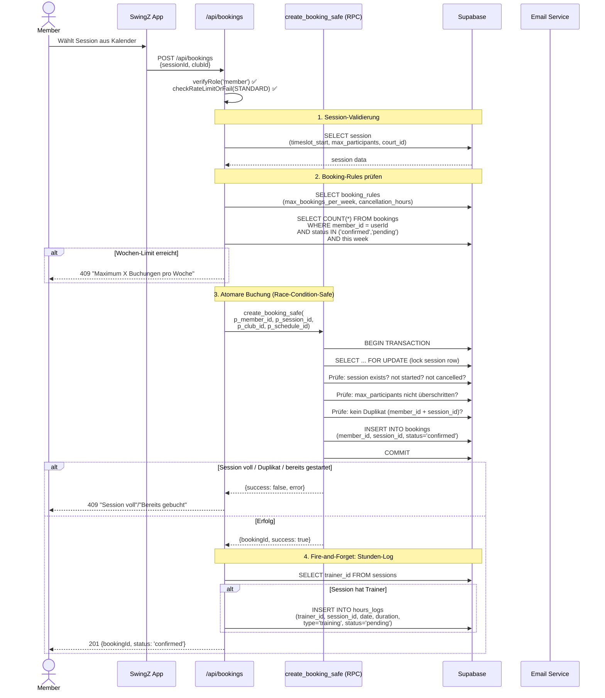
```mermaid
sequenceDiagram
    actor Member
    participant App as SwingZ App
    participant API as /api/bookings
    participant SafeRPC as create_booking_safe (RPC)
    participant DB as Supabase
    participant Mail as Email Service

    Member->>App: Wählt Session aus Kalender
    App->>API: POST /api/bookings<br/>{sessionId, clubId}
    API->>API: verifyRole('member') ✅<br/>checkRateLimitOrFail(STANDARD) ✅

    Note over API,DB: 1. Session-Validierung
    API->>DB: SELECT session<br/>(timeslot_start, max_participants, court_id)
    DB-->>API: session data

    Note over API,DB: 2. Booking-Rules prüfen
    API->>DB: SELECT booking_rules<br/>(max_bookings_per_week, cancellation_hours)
    API->>DB: SELECT COUNT(*) FROM bookings<br/>WHERE member_id = userId<br/>AND status IN ('confirmed','pending')<br/>AND this week
    alt Wochen-Limit erreicht
        API-->>Member: 409 "Maximum X Buchungen pro Woche"
    end

    Note over API,SafeRPC: 3. Atomare Buchung (Race-Condition-Safe)
    API->>SafeRPC: create_booking_safe(<br/>  p_member_id, p_session_id,<br/>  p_club_id, p_schedule_id)
    SafeRPC->>DB: BEGIN TRANSACTION
    SafeRPC->>DB: SELECT ... FOR UPDATE (lock session row)
    SafeRPC->>DB: Prüfe: session exists? not started? not cancelled?
    SafeRPC->>DB: Prüfe: max_participants nicht überschritten?
    SafeRPC->>DB: Prüfe: kein Duplikat (member_id + session_id)?
    SafeRPC->>DB: INSERT INTO bookings<br/>(member_id, session_id, status='confirmed')
    SafeRPC->>DB: COMMIT

    alt Session voll / Duplikat / bereits gestartet
        SafeRPC-->>API: {success: false, error}
        API-->>Member: 409 "Session voll"/"Bereits gebucht"
    else Erfolg
        SafeRPC-->>API: {bookingId, success: true}

        Note over API,DB: 4. Fire-and-Forget: Stunden-Log
        API->>DB: SELECT trainer_id FROM sessions
        alt Session hat Trainer
            API->>DB: INSERT INTO hours_logs<br/>(trainer_id, session_id, date, duration,<br/> type='training', status='pending')
        end

        API-->>Member: 201 {bookingId, status: 'confirmed'}
    end
```

### 1c. Member storniert Buchung

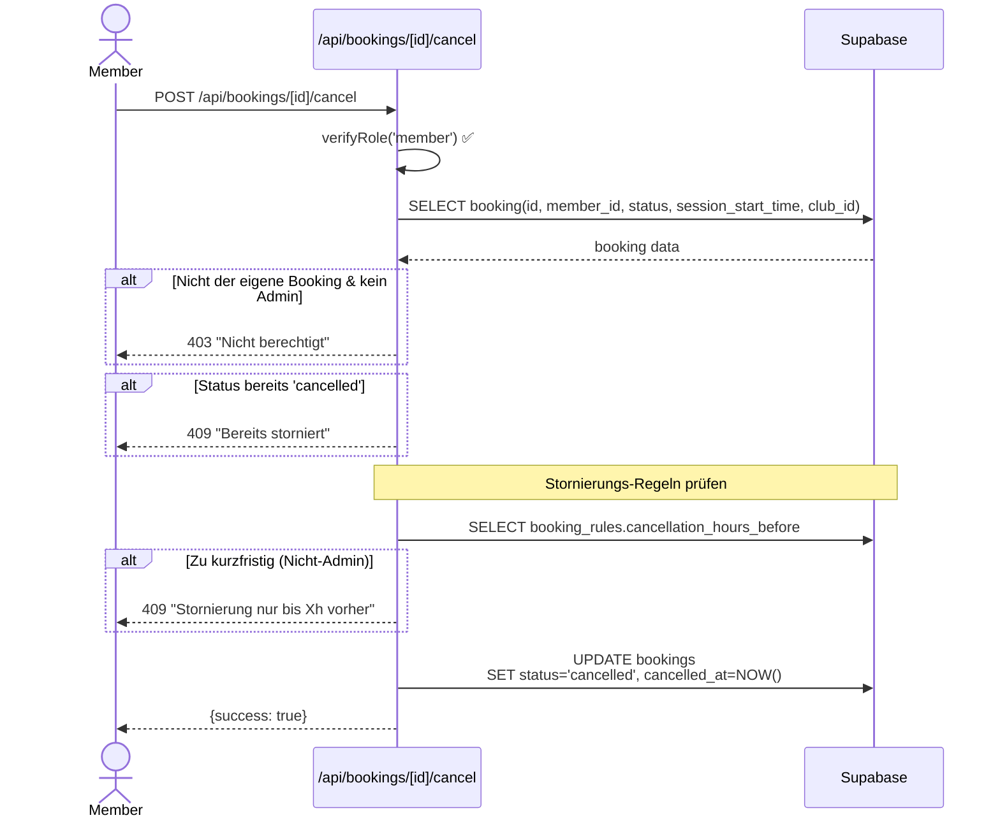
```mermaid
sequenceDiagram
    actor Member
    participant API as /api/bookings/[id]/cancel
    participant DB as Supabase

    Member->>API: POST /api/bookings/[id]/cancel
    API->>API: verifyRole('member') ✅

    API->>DB: SELECT booking(id, member_id, status, session_start_time, club_id)
    DB-->>API: booking data

    alt Nicht der eigene Booking & kein Admin
        API-->>Member: 403 "Nicht berechtigt"
    end

    alt Status bereits 'cancelled'
        API-->>Member: 409 "Bereits storniert"
    end

    Note over API,DB: Stornierungs-Regeln prüfen
    API->>DB: SELECT booking_rules.cancellation_hours_before
    alt Zu kurzfristig (Nicht-Admin)
        API-->>Member: 409 "Stornierung nur bis Xh vorher"
    end

    API->>DB: UPDATE bookings<br/>SET status='cancelled', cancelled_at=NOW()
    API-->>Member: {success: true}
```

---

## 🔁 Workflow 2: Saison-Planung & Publizierung

### 2a. Saison anlegen

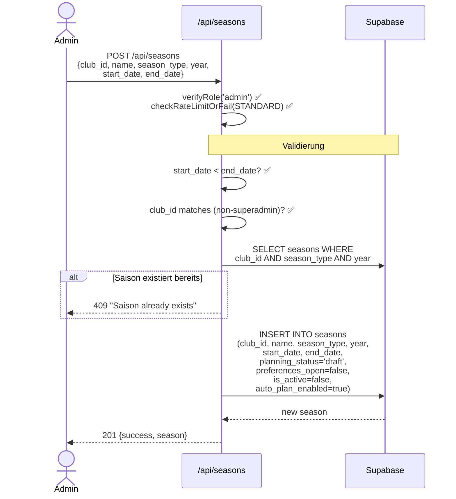
```mermaid
sequenceDiagram
    actor Admin
    participant API as /api/seasons
    participant DB as Supabase

    Admin->>API: POST /api/seasons<br/>{club_id, name, season_type, year,<br/> start_date, end_date}
    API->>API: verifyRole('admin') ✅<br/>checkRateLimitOrFail(STANDARD) ✅

    Note over API,DB: Validierung
    API->>API: start_date < end_date? ✅
    API->>API: club_id matches (non-superadmin)? ✅

    API->>DB: SELECT seasons WHERE<br/>club_id AND season_type AND year
    alt Saison existiert bereits
        API-->>Admin: 409 "Saison already exists"
    end

    API->>DB: INSERT INTO seasons<br/>(club_id, name, season_type, year,<br/> start_date, end_date,<br/> planning_status='draft',<br/> preferences_open=false,<br/> is_active=false,<br/> auto_plan_enabled=true)
    DB-->>API: new season

    API-->>Admin: 201 {success, season}
```

### 2b. Wizard: Clustering → Publizieren

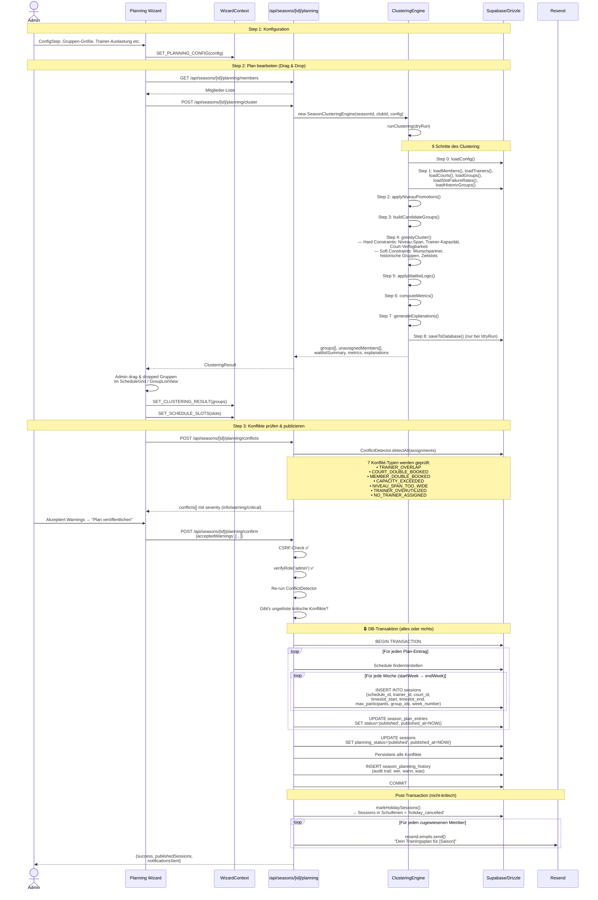
```mermaid
sequenceDiagram
    actor Admin
    participant Wizard as Planning Wizard
    participant Ctx as WizardContext
    participant API as /api/seasons/[id]/planning
    participant Engine as ClusteringEngine
    participant DB as Supabase/Drizzle
    participant Mail as Resend

    Note over Admin,DB: Step 1: Konfiguration
    Admin->>Wizard: ConfigStep: Gruppen-Größe, Trainer-Auslastung etc.
    Wizard->>Ctx: SET_PLANNING_CONFIG(config)

    Note over Admin,DB: Step 2: Plan bearbeiten (Drag & Drop)
    Wizard->>API: GET /api/seasons/[id]/planning/members
    API-->>Wizard: Mitglieder-Liste
    Wizard->>API: POST /api/seasons/[id]/planning/cluster
    API->>Engine: new SeasonClusteringEngine(seasonId, clubId, config)
    Engine->>Engine: runClustering(dryRun)

    Note over Engine,DB: 9 Schritte des Clustering:
    Engine->>DB: Step 0: loadConfig()
    Engine->>DB: Step 1: loadMembers(), loadTrainers(),<br/>loadCourts(), loadGroups(),<br/>loadSlotFailureRates(),<br/>loadHistoricGroups()
    Engine->>Engine: Step 2: applyNiveauPromotions()
    Engine->>Engine: Step 3: buildCandidateGroups()
    Engine->>Engine: Step 4: greedyCluster()<br/>— Hard Constraints: Niveau-Span, Trainer-Kapazität,<br/>  Court-Verfügbarkeit<br/>— Soft Constraints: Wunschpartner,<br/>  historische Gruppen, Zeitslots
    Engine->>Engine: Step 5: applyWaitlistLogic()
    Engine->>Engine: Step 6: computeMetrics()
    Engine->>Engine: Step 7: generateExplanations()
    Engine->>DB: Step 8: saveToDatabase() (nur bei !dryRun)

    Engine-->>API: groups[], unassignedMembers[],<br/>waitlistSummary, metrics, explanations
    API-->>Wizard: ClusteringResult

    Wizard->>Wizard: Admin drag & dropped Gruppen<br/>im ScheduleGrid / GroupListView
    Wizard->>Ctx: SET_CLUSTERING_RESULT(groups)
    Wizard->>Ctx: SET_SCHEDULE_SLOTS(slots)

    Note over Admin,DB: Step 3: Konflikte prüfen & publizieren
    Wizard->>API: POST /api/seasons/[id]/planning/conflicts
    API->>DB: ConflictDetector.detectAll(assignments)
    Note over API,DB: 7 Konflikt-Typen werden geprüft:<br/>• TRAINER_OVERLAP<br/>• COURT_DOUBLE_BOOKED<br/>• MEMBER_DOUBLE_BOOKED<br/>• CAPACITY_EXCEEDED<br/>• NIVEAU_SPAN_TOO_WIDE<br/>• TRAINER_OVERUTILIZED<br/>• NO_TRAINER_ASSIGNED
    API-->>Wizard: conflicts[] mit severity (info/warning/critical)

    Admin->>Wizard: Akzeptiert Warnings → "Plan veröffentlichen"
    Wizard->>API: POST /api/seasons/[id]/planning/confirm<br/>{acceptedWarnings: [...]}
    API->>API: CSRF-Check ✅
    API->>API: verifyRole('admin') ✅
    API->>API: Re-run ConflictDetector
    API->>API: Gibt's ungelöste kritische Konflikte?

    Note over API,DB: 🔒 DB-Transaktion (alles oder nichts)
    API->>DB: BEGIN TRANSACTION

    loop Für jeden Plan-Eintrag
        API->>DB: Schedule finden/erstellen
        loop Für jede Woche (startWeek → endWeek)
            API->>DB: INSERT INTO sessions<br/>(schedule_id, trainer_id, court_id,<br/> timeslot_start, timeslot_end,<br/> max_participants, group_ids, week_number)
        end
        API->>DB: UPDATE season_plan_entries<br/>SET status='published', published_at=NOW()
    end

    API->>DB: UPDATE seasons<br/>SET planning_status='published', published_at=NOW()
    API->>DB: Persistiere alle Konflikte
    API->>DB: INSERT season_planning_history<br/>(audit trail: wer, wann, was)
    API->>DB: COMMIT

    Note over API,Mail: Post-Transaction (nicht-kritisch)
    API->>DB: markHolidaySessions()<br/>→ Sessions in Schulferien = 'holiday_cancelled'

    loop Für jeden zugewiesenen Member
        API->>Mail: resend.emails.send()<br/>"Dein Trainingsplan für [Saison]"
    end

    API-->>Admin: {success, publishedSessions,<br/>notificationsSent}
```

---

## 🔁 Workflow 3: Monatliche Abrechnung & Zahlung

### 3a. Rechnungen generieren (Admin)

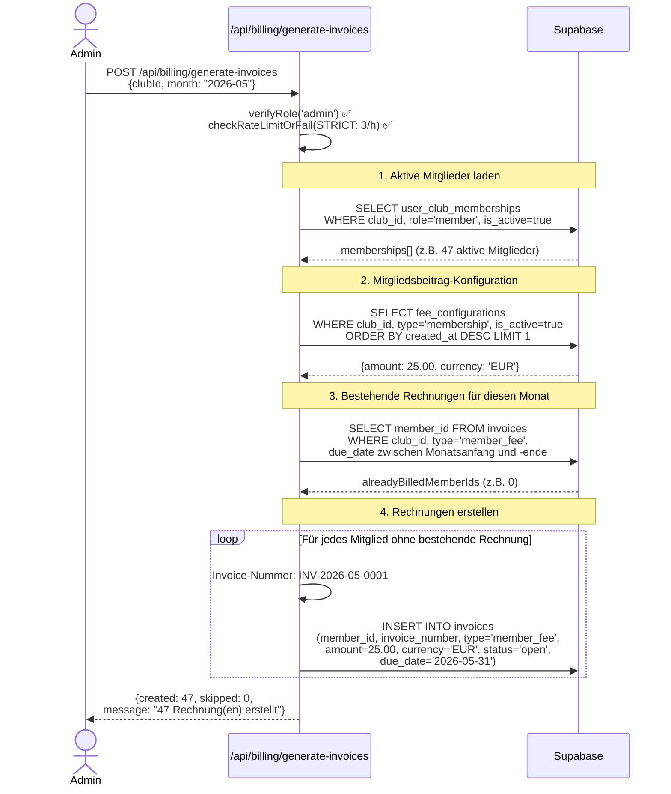
```mermaid
sequenceDiagram
    actor Admin
    participant API as /api/billing/generate-invoices
    participant DB as Supabase

    Admin->>API: POST /api/billing/generate-invoices<br/>{clubId, month: "2026-05"}
    API->>API: verifyRole('admin') ✅<br/>checkRateLimitOrFail(STRICT: 3/h) ✅

    Note over API,DB: 1. Aktive Mitglieder laden
    API->>DB: SELECT user_club_memberships<br/>WHERE club_id, role='member', is_active=true
    DB-->>API: memberships[] (z.B. 47 aktive Mitglieder)

    Note over API,DB: 2. Mitgliedsbeitrag-Konfiguration
    API->>DB: SELECT fee_configurations<br/>WHERE club_id, type='membership', is_active=true<br/>ORDER BY created_at DESC LIMIT 1
    DB-->>API: {amount: 25.00, currency: 'EUR'}

    Note over API,DB: 3. Bestehende Rechnungen für diesen Monat
    API->>DB: SELECT member_id FROM invoices<br/>WHERE club_id, type='member_fee',<br/>due_date zwischen Monatsanfang und -ende
    DB-->>API: alreadyBilledMemberIds (z.B. 0)

    Note over API,DB: 4. Rechnungen erstellen
    loop Für jedes Mitglied ohne bestehende Rechnung
        API->>API: Invoice-Nummer: INV-2026-05-0001
        API->>DB: INSERT INTO invoices<br/>(member_id, invoice_number, type='member_fee',<br/> amount=25.00, currency='EUR', status='open',<br/> due_date='2026-05-31')
    end

    API-->>Admin: {created: 47, skipped: 0,<br/>message: "47 Rechnung(en) erstellt"}
```

### 3b. Zahlungseingang verbuchen

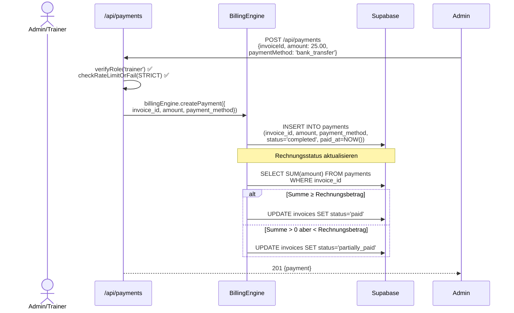
```mermaid
sequenceDiagram
    actor Admin/Trainer
    participant API as /api/payments
    participant Engine as BillingEngine
    participant DB as Supabase

    Admin->>API: POST /api/payments<br/>{invoiceId, amount: 25.00,<br/> paymentMethod: 'bank_transfer'}
    API->>API: verifyRole('trainer') ✅<br/>checkRateLimitOrFail(STRICT) ✅

    API->>Engine: billingEngine.createPayment({<br/>  invoice_id, amount, payment_method})
    Engine->>DB: INSERT INTO payments<br/>(invoice_id, amount, payment_method,<br/> status='completed', paid_at=NOW())

    Note over Engine,DB: Rechnungsstatus aktualisieren
    Engine->>DB: SELECT SUM(amount) FROM payments<br/>WHERE invoice_id
    alt Summe ≥ Rechnungsbetrag
        Engine->>DB: UPDATE invoices SET status='paid'
    else Summe > 0 aber < Rechnungsbetrag
        Engine->>DB: UPDATE invoices SET status='partially_paid'
    end

    API-->>Admin: 201 {payment}
```

### 3c. SEPA-Lastschrift (PAIN.008)

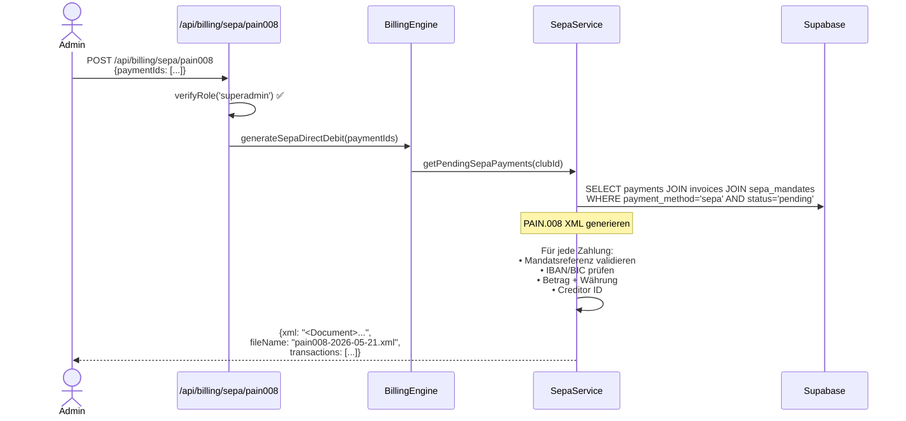
```mermaid
sequenceDiagram
    actor Admin
    participant API as /api/billing/sepa/pain008
    participant Engine as BillingEngine
    participant Sepa as SepaService
    participant DB as Supabase

    Admin->>API: POST /api/billing/sepa/pain008<br/>{paymentIds: [...]}
    API->>API: verifyRole('superadmin') ✅

    API->>Engine: generateSepaDirectDebit(paymentIds)
    Engine->>Sepa: getPendingSepaPayments(clubId)
    Sepa->>DB: SELECT payments JOIN invoices JOIN sepa_mandates<br/>WHERE payment_method='sepa' AND status='pending'

    Note over Sepa: PAIN.008 XML generieren
    Sepa->>Sepa: Für jede Zahlung:<br/>• Mandatsreferenz validieren<br/>• IBAN/BIC prüfen<br/>• Betrag + Währung<br/>• Creditor ID

    Sepa-->>Admin: {xml: "<Document>...",<br/>fileName: "pain008-2026-05-21.xml",<br/>transactions: [...]}
```

---

## 🔁 Workflow 4: Trainer-Stunden → Abrechnung

### 4a. Automatische Stunden-Erfassung (via Buchung)

> Wenn ein Member eine Session mit Trainer bucht, wird automatisch ein `hours_log`-Eintrag erstellt.

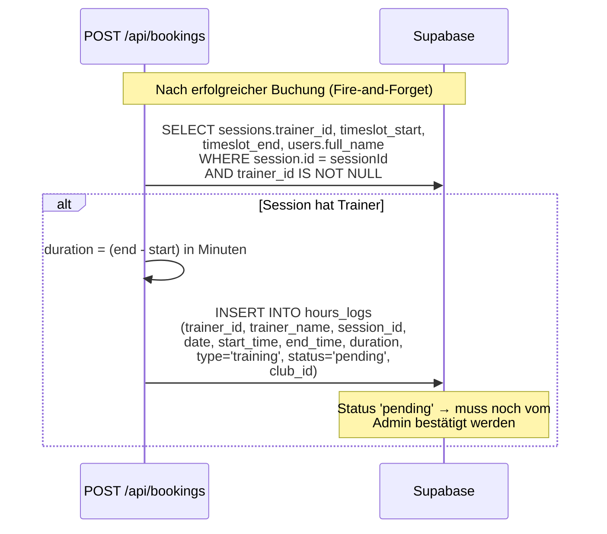
```mermaid
sequenceDiagram
    participant API as POST /api/bookings
    participant DB as Supabase

    Note over API,DB: Nach erfolgreicher Buchung (Fire-and-Forget)

    API->>DB: SELECT sessions.trainer_id, timeslot_start,<br/>timeslot_end, users.full_name<br/>WHERE session.id = sessionId<br/>AND trainer_id IS NOT NULL

    alt Session hat Trainer
        API->>API: duration = (end - start) in Minuten
        API->>DB: INSERT INTO hours_logs<br/>(trainer_id, trainer_name, session_id,<br/> date, start_time, end_time, duration,<br/> type='training', status='pending',<br/> club_id)
        Note over DB: Status 'pending' → muss noch vom<br/>Admin bestätigt werden
    end
```

### 4b. Trainer erfasst manuell Stunden

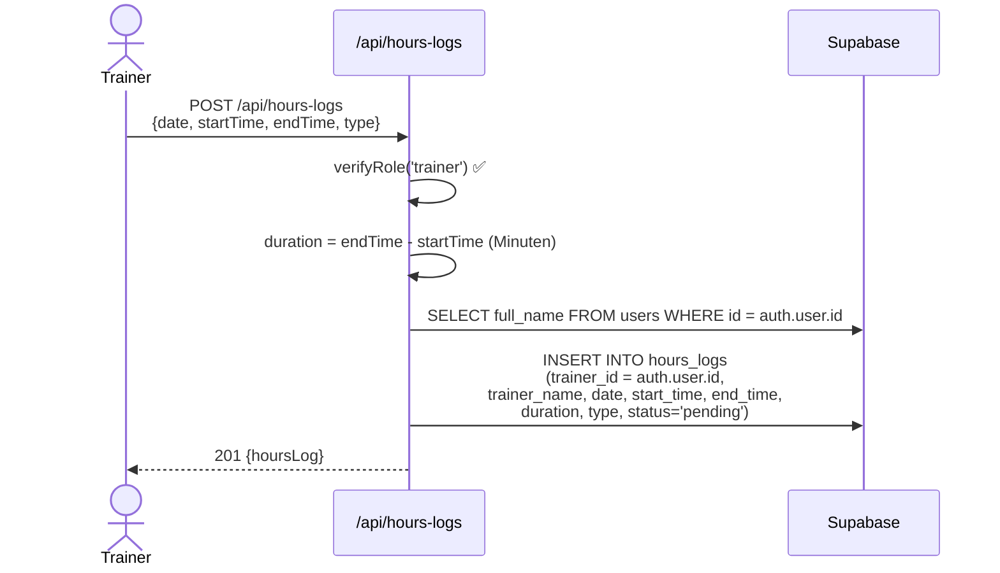
```mermaid
sequenceDiagram
    actor Trainer
    participant API as /api/hours-logs
    participant DB as Supabase

    Trainer->>API: POST /api/hours-logs<br/>{date, startTime, endTime, type}
    API->>API: verifyRole('trainer') ✅

    API->>API: duration = endTime - startTime (Minuten)
    API->>DB: SELECT full_name FROM users WHERE id = auth.user.id
    API->>DB: INSERT INTO hours_logs<br/>(trainer_id = auth.user.id,<br/> trainer_name, date, start_time, end_time,<br/> duration, type, status='pending')
    API-->>Trainer: 201 {hoursLog}
```

### 4c. Admin genehmigt Stunden → Trainer-Abrechnung

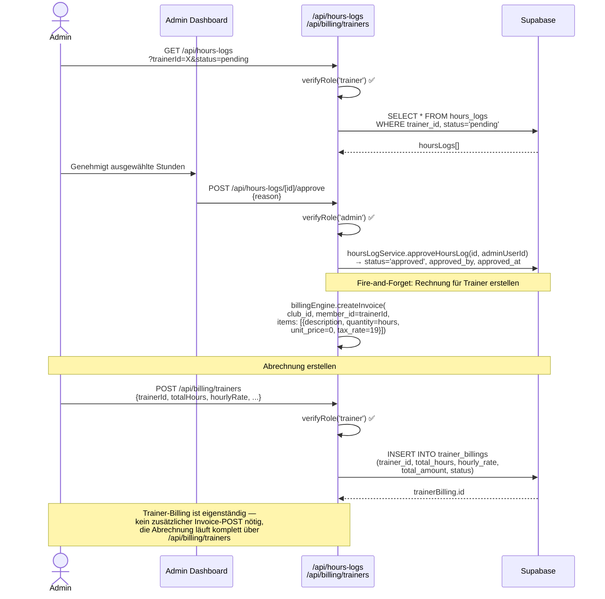
```mermaid
sequenceDiagram
    actor Admin
    participant App as Admin Dashboard
    participant API as /api/hours-logs<br/>/api/billing/trainers
    participant DB as Supabase

    Admin->>API: GET /api/hours-logs<br/>?trainerId=X&status=pending
    API->>API: verifyRole('trainer') ✅

    API->>DB: SELECT * FROM hours_logs<br/>WHERE trainer_id, status='pending'
    DB-->>API: hoursLogs[]

    Admin->>App: Genehmigt ausgewählte Stunden
    App->>API: POST /api/hours-logs/[id]/approve<br/>{reason}
    API->>API: verifyRole('admin') ✅
    API->>DB: hoursLogService.approveHoursLog(id, adminUserId)<br/> → status='approved', approved_by, approved_at

    Note over API,DB: Fire-and-Forget: Rechnung für Trainer erstellen
    API->>API: billingEngine.createInvoice(<br/>  club_id, member_id=trainerId,<br/>  items: [{description, quantity=hours,<br/>    unit_price=0, tax_rate=19}])

    Note over Admin,DB: Abrechnung erstellen
    Admin->>API: POST /api/billing/trainers<br/>{trainerId, totalHours, hourlyRate, ...}
    API->>API: verifyRole('trainer') ✅

    API->>DB: INSERT INTO trainer_billings<br/>(trainer_id, total_hours, hourly_rate,<br/> total_amount, status)
    DB-->>API: trainerBilling.id

    Note over Admin,API: Trainer-Billing ist eigenständig —<br/>kein zusätzlicher Invoice-POST nötig,<br/>die Abrechnung läuft komplett über<br/>/api/billing/trainers
```

---

## 🔁 Workflow 5: Member-Lebenszyklus (End-to-End)

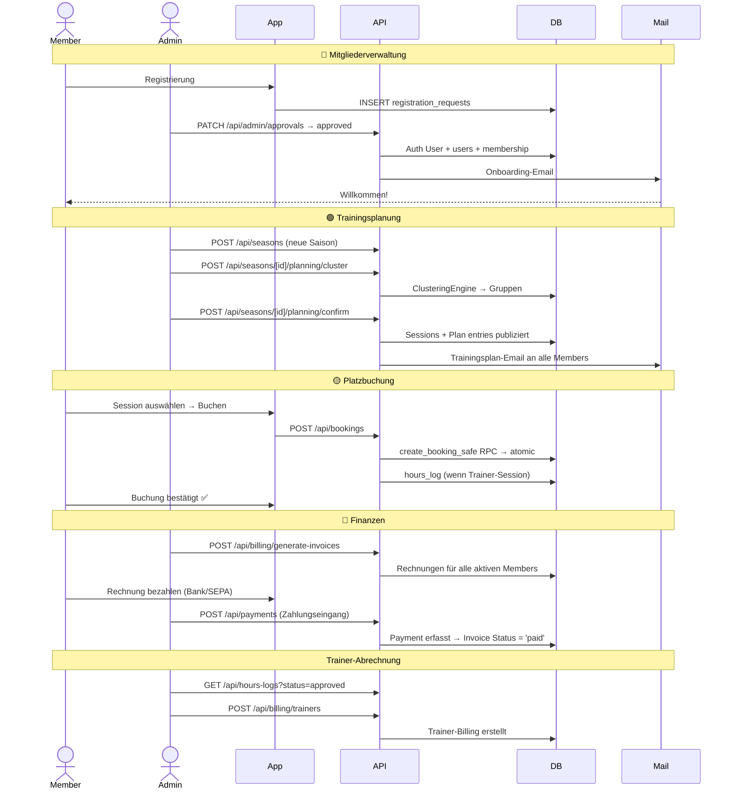
```mermaid
sequenceDiagram
    actor Member
    actor Admin
    participant App
    participant API
    participant DB
    participant Mail

    Note over Member,Mail: 🔴 Mitgliederverwaltung
    Member->>App: Registrierung
    App->>DB: INSERT registration_requests
    Admin->>API: PATCH /api/admin/approvals → approved
    API->>DB: Auth User + users + membership
    API->>Mail: Onboarding-Email
    Mail-->>Member: Willkommen!

    Note over Member,Mail: 🟢 Trainingsplanung
    Admin->>API: POST /api/seasons (neue Saison)
    Admin->>API: POST /api/seasons/[id]/planning/cluster
    API->>DB: ClusteringEngine → Gruppen
    Admin->>API: POST /api/seasons/[id]/planning/confirm
    API->>DB: Sessions + Plan entries publiziert
    API->>Mail: Trainingsplan-Email an alle Members

    Note over Member,Mail: 🟡 Platzbuchung
    Member->>App: Session auswählen → Buchen
    App->>API: POST /api/bookings
    API->>DB: create_booking_safe RPC → atomic
    API->>DB: hours_log (wenn Trainer-Session)
    Member->>App: Buchung bestätigt ✅

    Note over Member,Mail: 🔵 Finanzen
    Admin->>API: POST /api/billing/generate-invoices
    API->>DB: Rechnungen für alle aktiven Members
    Member->>App: Rechnung bezahlen (Bank/SEPA)
    Admin->>API: POST /api/payments (Zahlungseingang)
    API->>DB: Payment erfasst → Invoice Status = 'paid'

    Note over Member,Mail: Trainer-Abrechnung
    Admin->>API: GET /api/hours-logs?status=approved
    Admin->>API: POST /api/billing/trainers
    API->>DB: Trainer-Billing erstellt
```

---

## 🗂️ System-Architektur: Schichten & Datenfluss

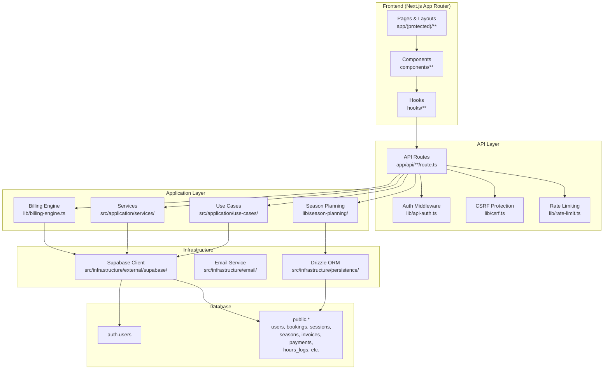
```mermaid
graph TB
    subgraph "Frontend (Next.js App Router)"
        Pages["Pages & Layouts<br/>app/(protected)/**"]
        Components["Components<br/>components/**"]
        Hooks["Hooks<br/>hooks/**"]
    end

    subgraph "API Layer"
        Routes["API Routes<br/>app/api/**/route.ts"]
        Auth["Auth Middleware<br/>lib/api-auth.ts"]
        CSRF["CSRF Protection<br/>lib/csrf.ts"]
        RateLimit["Rate Limiting<br/>lib/rate-limit.ts"]
    end

    subgraph "Application Layer"
        UseCases["Use Cases<br/>src/application/use-cases/"]
        Services["Services<br/>src/application/services/"]
        Wizard["Season Planning<br/>lib/season-planning/"]
        Billing["Billing Engine<br/>lib/billing-engine.ts"]
    end

    subgraph "Infrastructure"
        Supabase["Supabase Client<br/>src/infrastructure/external/supabase/"]
        Email["Email Service<br/>src/infrastructure/email/"]
        Persistence["Drizzle ORM<br/>src/infrastructure/persistence/"]
    end

    subgraph "Database"
        AuthDB["auth.users"]
        PublicDB["public.*<br/>users, bookings, sessions,<br/>seasons, invoices, payments,<br/>hours_logs, etc."]
    end

    Pages --> Components
    Components --> Hooks
    Hooks --> Routes
    Routes --> Auth
    Routes --> CSRF
    Routes --> RateLimit
    Routes --> UseCases
    Routes --> Services
    Routes --> Wizard
    Routes --> Billing
    UseCases --> Supabase
    Services --> Supabase
    Wizard --> Persistence
    Billing --> Supabase
    Persistence --> PublicDB
    Supabase --> AuthDB
    Supabase --> PublicDB
```

---

## 🔐 Sicherheits-Schichten pro Request

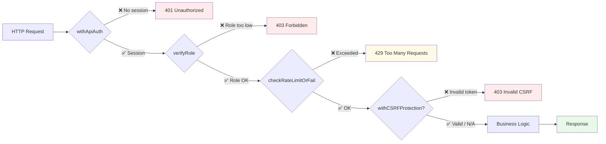
```mermaid
flowchart LR
    A[HTTP Request] --> B{withApiAuth}
    B -->|❌ No session| B1[401 Unauthorized]
    B -->|✅ Session| C{verifyRole}
    C -->|❌ Role too low| C1[403 Forbidden]
    C -->|✅ Role OK| D{checkRateLimitOrFail}
    D -->|❌ Exceeded| D1[429 Too Many Requests]
    D -->|✅ OK| E{withCSRFProtection?}
    E -->|❌ Invalid token| E1[403 Invalid CSRF]
    E -->|✅ Valid / N/A| F[Business Logic]
    F --> G[Response]

    style B1 fill:#ff6b6b22
    style C1 fill:#ff6b6b22
    style D1 fill:#ffd43b22
    style E1 fill:#ff6b6b22
    style G fill:#51cf6622
```

| Schicht       | Mechanismus                                                       | Fehler      |
| ------------- | ----------------------------------------------------------------- | ----------- |
| 1. Auth       | `withApiAuth` → Supabase Session Cookie                           | 401         |
| 2. Role       | `verifyRole(auth, 'admin'\|'trainer'\|'member')`                  | 403         |
| 3. Rate Limit | `checkRateLimitOrFail(req, {max, windowMs})`                      | 429         |
| 4. CSRF       | `withCSRFProtection` (nur bei POST/PATCH/DELETE mit Side Effects) | 403         |
| 5. Business   | Zod-Validierung, Club-Zugehörigkeit, Business-Rules               | 400/409/500 |

---

## 📋 Rollen-Matrix: Wer darf was?

| Aktion                          | Member | Trainer | Admin | Superadmin |
| ------------------------------- | :----: | :-----: | :---: | :--------: |
| **Eigene Buchungen**            |   ✅   |   ✅    |  ✅   |     ✅     |
| **Session buchen**              |   ✅   |   ✅    |  ✅   |     ✅     |
| **Buchung stornieren (eigene)** |   ✅   |   ✅    |  ✅   |     ✅     |
| **Buchungsstatus ändern**       |   ❌   |   ✅    |  ✅   |     ✅     |
| **Stunden erfassen**            |   ❌   |   ✅    |  ✅   |     ✅     |
| **Stunden genehmigen**          |   ❌   |   ❌    |  ✅   |     ✅     |
| **Mitglieder verwalten**        |   ❌   |   ❌    |  ✅   |     ✅     |
| **Mitglieder einladen**         |   ❌   |   ❌    |  ✅   |     ✅     |
| **Registrierungen genehmigen**  |   ❌   |   ❌    |  ✅   |     ✅     |
| **Saison erstellen**            |   ❌   |   ❌    |  ✅   |     ✅     |
| **Saison-Planung (Wizard)**     |   ❌   |   ❌    |  ✅   |     ✅     |
| **Rechnungen generieren**       |   ❌   |   ❌    |  ✅   |     ✅     |
| **Zahlungen erfassen**          |   ❌   |   ✅    |  ✅   |     ✅     |
| **SEPA-Lastschrift**            |   ❌   |   ❌    |  ❌   |     ✅     |
| **Trainer-Abrechnung**          |   ❌   |   ❌    |  ✅   |     ✅     |
| **Eigene Rechnungen sehen**     |   ✅   |   ✅    |  ✅   |     ✅     |
| **Alle Rechnungen sehen**       |   ❌   |   ❌    |  ✅   |     ✅     |

---

## 🔗 Datei-Übersicht

| Schicht            | Datei                                                   | Beschreibung                       |
| ------------------ | ------------------------------------------------------- | ---------------------------------- |
| **API Routes**     | `app/api/bookings/route.ts`                             | Buchung erstellen + eigene abrufen |
|                    | `app/api/bookings/[id]/cancel/route.ts`                 | Buchung stornieren                 |
|                    | `app/api/bookings/[id]/status/route.ts`                 | Status ändern (Admin/Trainer)      |
|                    | `app/api/bookings/series/route.ts`                      | Serienbuchung                      |
|                    | `app/api/seasons/route.ts`                              | Saisons CRUD                       |
|                    | `app/api/seasons/[id]/planning/cluster/route.ts`        | Clustering ausführen               |
|                    | `app/api/seasons/[id]/planning/confirm/route.ts`        | Plan publizieren (Transaktion)     |
|                    | `app/api/billing/generate-invoices/route.ts`            | Monats-Rechnungen                  |
|                    | `app/api/billing/invoices/route.ts`                     | Ad-hoc-Rechnungen                  |
|                    | `app/api/billing/trainers/route.ts`                     | Trainer-Abrechnung                 |
|                    | `app/api/payments/route.ts`                             | Zahlungen erfassen                 |
|                    | `app/api/hours-logs/route.ts`                           | Stunden CRUD (GET, POST)           |
|                    | `app/api/hours-logs/[id]/route.ts`                      | Einzel-Stunde (GET, PATCH, DELETE) |
|                    | `app/api/hours-logs/[id]/approve/route.ts`              | Genehmigen + Auto-Invoice          |
|                    | `app/api/hours-logs/[id]/reject/route.ts`               | Ablehnen mit Begründung            |
|                    | `app/api/members/invite/route.ts`                       | Member-Einladung                   |
|                    | `app/api/admin/approvals/route.ts`                      | Registrierungen genehmigen         |
| **Business Logic** | `lib/booking/safe-booking.ts`                           | Atomare Buchung (RPC)              |
|                    | `lib/season-planning/clustering-engine.ts`              | Greedy-Clustering (9 Steps)        |
|                    | `lib/season-planning/conflict-detector.ts`              | 7 Konflikt-Typen                   |
|                    | `lib/billing-engine.ts`                                 | Billing Facade (Singleton)         |
|                    | `src/application/use-cases/booking-status.use-cases.ts` | Buchungsstatus-Änderung            |
| **Security**       | `lib/api-auth.ts`                                       | `withApiAuth`, `verifyRole`        |
|                    | `lib/rate-limit.ts`                                     | `checkRateLimitOrFail`             |
|                    | `lib/csrf.ts`                                           | `withCSRFProtection`               |
| **Documentation**  | `docs/api-routes-overview.md`                           | API-Routen-Referenz                |
|                    | `docs/season-planning-wizard.md`                        | Wizard-Architektur                 |
|                    | `docs/workflows.md`                                     | Diese Datei                        |
