# Themen-Interplay — Sequenzdiagramme der Schlüssel-Flows

> Wie Module, Rollen, DB-Tabellen und externe Services zusammenspielen. Diagramm-Repräsentation dessen, was im Code als Datenfluss passiert.

## 🎾 1. Mitglied bucht Training

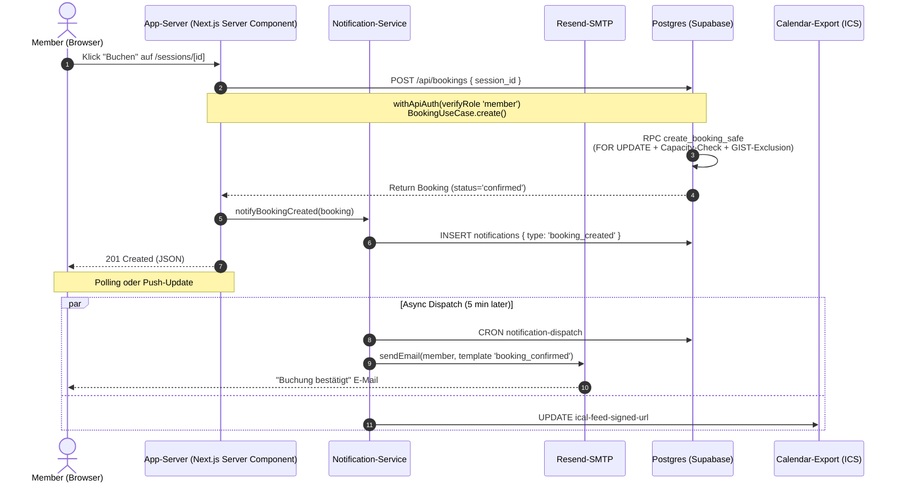

**Tables beteiligt:** `bookings`, `sessions`, `notifications`, `notification_dispatch`, `members`.
**Files beteiligt:** `app/api/bookings/route.ts`, `src/application/use-cases/booking.use-cases.ts`, `src/infrastructure/persistence/repositories/booking.repository.ts`, `lib/notifications/notification.service.ts`, `app/api/cron/notification-dispatch/route.ts`.

## 🌾 2. Admin plant Saison mit KI

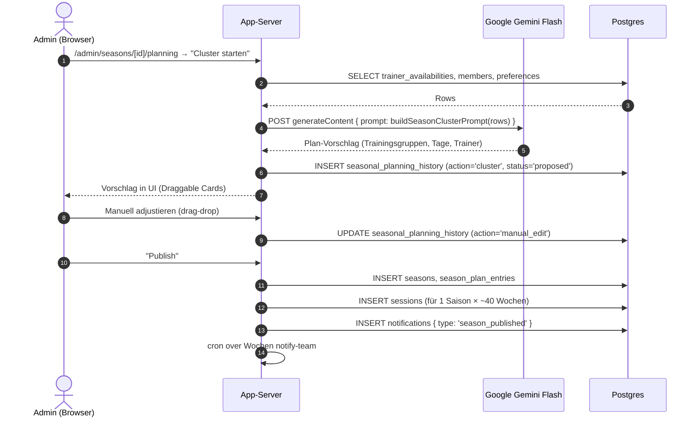

**Modules beteiligt:** `seasons` (core), `ai_matchmaking` (optional).
**Files:** `app/(protected)/admin/(gated)/seasons/[id]/planning/`, `app/api/ai/season-cluster/route.ts`.

## 💳 3. Member zahlt Rechnung via Stripe

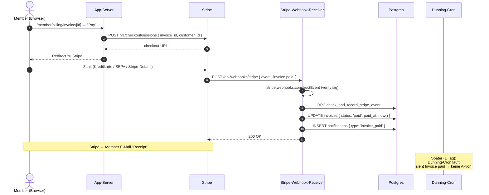

**Files:** `app/api/stripe/checkout/route.ts`, `app/api/webhooks/stripe/route.ts`, `lib/services/billing.service.ts`.
**P0-Lücken in diesem Flow:**

- `invoice.payment_failed` wird nicht behandelt (P0-8)
- Plan-Switch erzeugt ggf. Doppel-Belastung (P0-7)

## 🧪 4. Probetraining-Anmeldung → Genehmigung → Membership

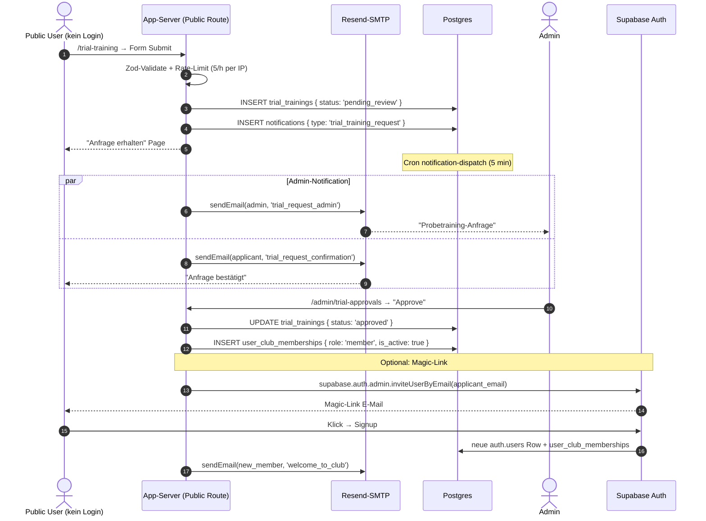

**Tables:** `trial_trainings`, `notifications`, `user_club_memberships`, `members`.
**Files:** `app/(public)/trial-training/`, `app/api/public/trial-training/route.ts`, `app/(protected)/admin/(gated)/trial-approvals/`.

## ⚗ 5. Mahnwesen-Stufen

```mermaid
sequenceDiagram
    autonumber
    participant Cron as Dunning-Cron (täglich 09:00)
    participant PG as Postgres
    participant N as Notification-Service
    R over Email: Resend-SMTP (an Member)

    Cron->>PG: SELECT invoices WHERE status='pending' AND due_date < now()
    Loop pro Invoice
        alt Stufe 0 → 1 (15 Tage)
            Cron->>PG: UPDATE invoice { dunning_level: 1, late_fee: 5€ }
            Cron->>N: INSERT notifications { type: 'dunning_stage_1' }
            N->>Email: "1. Mahnung" Template
        else Stufe 1 → 2 (30 Tage)
            Cron->>PG: UPDATE invoice { dunning_level: 2, late_fee: 10€ }
            Cron->>N: INSERT notifications { type: 'dunning_stage_2' }
            N->>Email: "2. Mahnung + Verzugszins" Template
        else Stufe 2 → 3 (45 Tage)
            Cron->>PG: UPDATE invoice { dunning_level: 3, account_frozen: true }
            Cron->>PG: UPDATE user_club_memberships { is_active: false }
            Cron->>N: INSERT notifications { type: 'account_frozen' }
            N->>Email: "Inkasso-Drohung" Template
        end
    end
```

**Routes:** `app/api/cron/overdue-invoices/route.ts`, `app/api/cron/dunning-sync/route.ts`.
**⚠️ P0-8 Lücke:** Wenn Member mit SEPA/Lastschrift zahlt und Bank rejected → Stripe sendet `invoice.payment_failed` → unser Code reagiert NICHT. Folge: Dunning-Cron sieht nur via Datenbank-Stand, NICHT aktuelle Stripe-Status.

## 🏗 6. Smart-Court Hardware-Integration

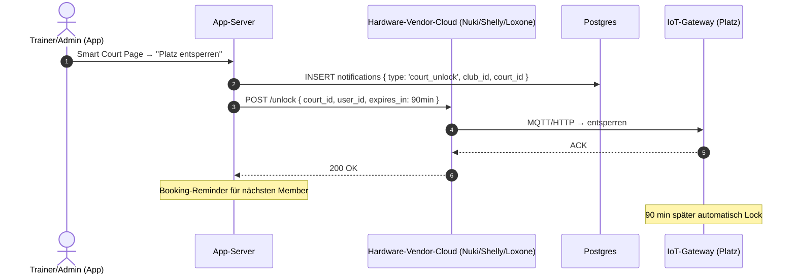

**Voraussetzung:** `smart_court` Feature aktiv + Add-On Tier Professional + Hardware-Vendor-Setup.
**Tables:** `notifications`, smart_court-spezifische (Vendor-Account-Mapping).

## 🗳 7. Mitglieder-Abstimmung (Decisions)

```mermaid
sequenceDiagram
    autonumber
    actor A as Admin
    actor M1, M2 as Members
    participant SC as App-Server
    participant PG as Postgres

    A->>SC: /admin/decisions → "Neuer Vorschlag"
    SC->>PG: INSERT decision_proposals { status: 'open', deadline }
    SC->>PG: INSERT notifications { type: 'decision.published', recipient_ids: [alle_members] }

    M1->>SC: /member/decisions → Vote Up
    SC->>PG: INSERT decision_votes { member_id, proposal_id, vote: 'yes' }
    M2->>SC: /member/decisions → Vote No
    SC->>PG: INSERT decision_votes { member_id, proposal_id, vote: 'no' }

    Note over PG: Nach deadline
    Cron->>PG: SELECT * WHERE status='open' AND deadline<now()
    Cron->>PG: close decision_proposal(s) → status='closed', result
    Cron->>PG: INSERT notifications { type: 'decision.closed' }
```

**Tables:** `decision_proposals`, `decision_votes`, `notifications`, `audit_decision_changes`.
**Files:** `app/(protected)/admin/(gated)/decisions/`, `app/(protected)/member/decisions/`.

## 🔐 8. Owner lädt Admin ein (Cross-Tenant Onboarding)

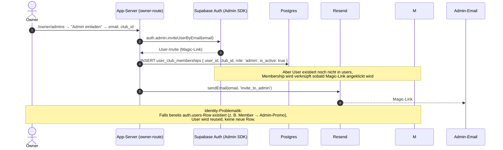

**P0-Relevanz:** P0-3 betrifft genau diese Route — Migration `20260621_add_owner_role.sql` muss mit dem Insert harmonieren.

## 🎯 9–15 · Tutorial-konkrete Mikro-Flows

Die großen Diagramme 1–8 oben zeigen **End-to-End-Patterns**. Hier sind die **kleinen konkreten Strecken**, die in den Schritt-für-Schritt-Tutorials tatsächlich durchlaufen werden. Jedes Diagramm verlinkt einen detaillierten Walkthrough. Alle Diagramme sind 1:1 aus den Source-Komponenten abgeleitet.

### 9 · Trainer pflegt Verfügbarkeit (Save: DELETE-before-POST)

> Walkthrough: [`tutorials/trainer-availability.md`](../user/tutorials/trainer-availability.md)
> Logik: Vor jedem POST werden alle API-Slots, die nicht mehr in der UI vorkommen, gelöscht — 409 (Slot ist mit `session` verknüpft) wird **stillschweigend ignoriert**.

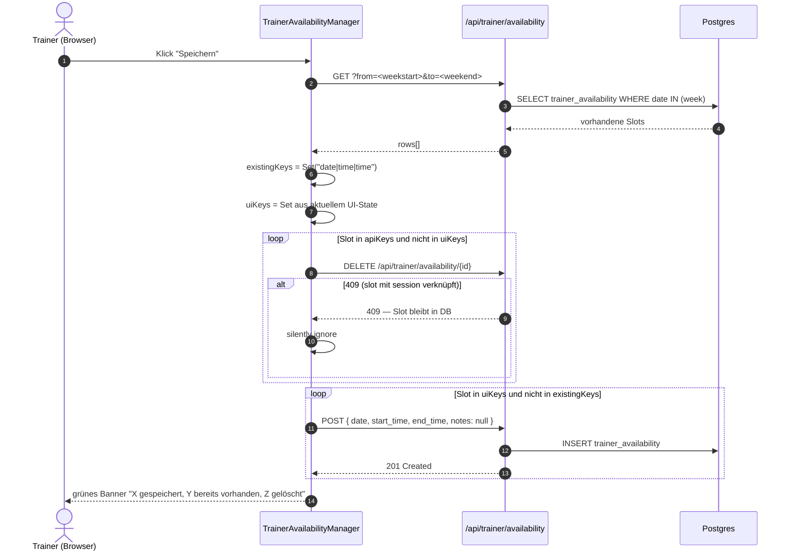

### 10 · Trainer bulked — "Auf alle Wochen im Monat anwenden"

> Walkthrough: [`tutorials/trainer-availability.md`](../user/tutorials/trainer-availability.md)
> Aktion ist **idempotent** — POST-Skip wenn Key bereits existiert, niemals destruktiv.

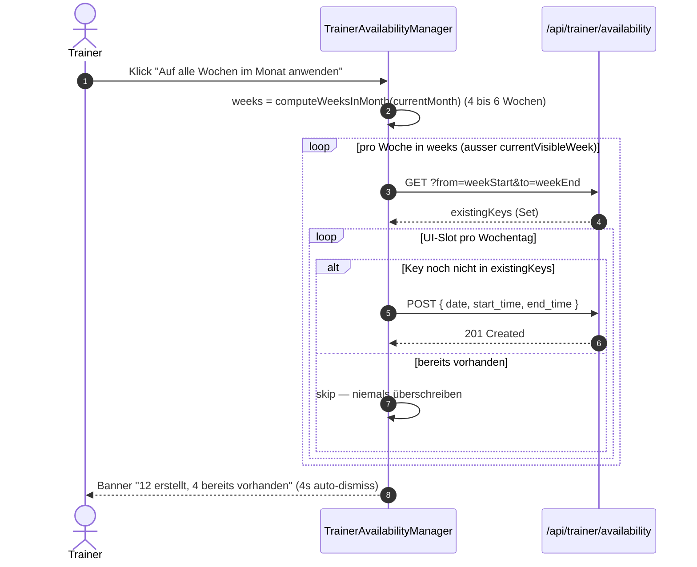

### 11 · Trainer-Check-in (RSVP → Attendance-Record)

> Walkthrough: [`tutorials/trainer-sessions-and-checkin.md`](../user/tutorials/trainer-sessions-and-checkin.md)
> **Kein** Optimistic Update: Pill bleibt im IDLE-State bis 200 OK eintrifft; bei Fehler Toast ohne State-Change.

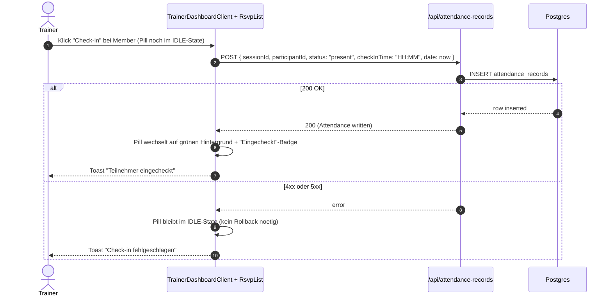

### 12 · 2FA-Enrollment (TOTP) — Enroll → Hand-Paste-Code → Verify → optional Unenroll

> Walkthrough: [`tutorials/member-profile-security-billing.md`](../user/tutorials/member-profile-security-billing.md)
> 4 Schritte aus `supabase.auth.mfa.*`: `listFactors` (mount) → `enroll` → `challengeAndVerify` → `unenroll`.

```mermaid
sequenceDiagram
    autonumber
    actor M as Member
    participant C as MemberProfile (Sicherheit-Tab)
    participant SB as supabase.auth.mfa

    M->>C: Mount der Sicherheit-Card
    C->>SB: mfa.listFactors()
    SB-->>C: { totp: [verified-oder-leer] }

    alt kein verified TOTP
        C->>SB: mfa.enroll({ factorType: "totp", issuer: "SwingZ" })
        SB-->>C: enroll Response (id, qr_code als base64 PNG, secret)
        C-->>M: QR-Code-Image + manueller Secret + 6-digit Input
        M->>C: 6-stelliger Code (Enter oder "Bestätigen")
        C->>SB: mfa.challengeAndVerify({ factorId, code })
        alt gültig
            SB-->>C: 200 OK
            C-->>M: Toast "2FA aktiviert" + Status "2FA ist aktiv"
        else ungültig
            SB-->>C: 401 invalid
            C-->>M: Toast "Ungültiger Code — erneut versuchen"
        end
    else bereits verified TOTP
        C-->>M: Badge "2FA ist aktiv" + Danger-Outline "2FA deaktivieren"
        M->>C: Klick
        C->>SB: mfa.unenroll({ factorId })
        SB-->>C: 200 OK
        C-->>M: Toast "2FA deaktiviert"
    end
```

### 13 · Account löschen (Anonymize-Service statt Hard-Delete)

> Walkthrough: [`tutorials/member-profile-security-billing.md`](../user/tutorials/member-profile-security-billing.md)
> DSGVO + GoBD: User-PII wird anonymisiert, **Buchungen + Invoices bleiben 10 Jahre** in der DB (GoBD §147 AO).

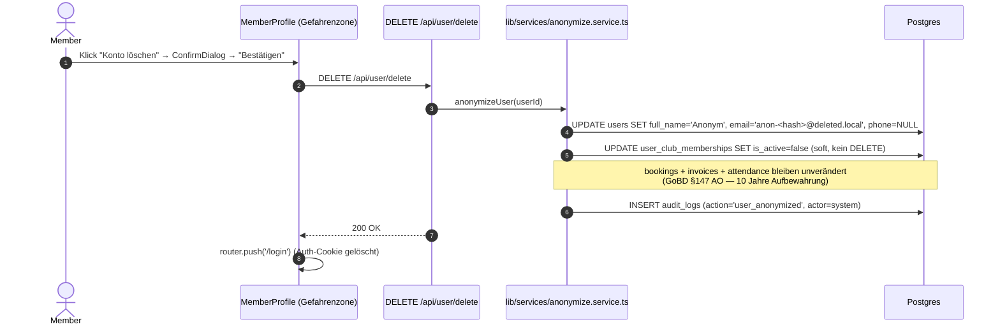

### 14 · Admin konvertiert Probetraining-Teilnehmer → Mitglied

> Walkthrough: [`tutorials/admin-trial-approvals.md`](../user/tutorials/admin-trial-approvals.md)
> Voraussetzung: `status='scheduled' | 'completed'`. Konvertierung erzeugt Supabase-Account + `user_club_memberships`-Row in **einem** Schritt.

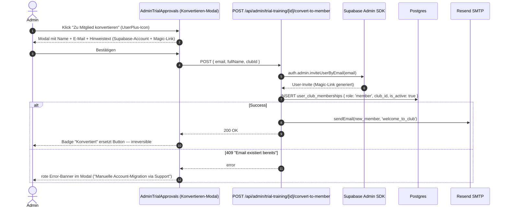

### 15 · Admin erstellt Rechnung — Membership-Fee-Gate

> Walkthrough: [`tutorials/admin-billing.md`](../user/tutorials/admin-billing.md)
> **Sub-Feature-Scope (Finanzen-Modul #4 in [`docs/HANDBOOK.md`](../../HANDBOOK.md#modul-index-13-features-pro-verein)):** Dunning-Stufen 0/1/2/3 sind Teil des selben Moduls wie Rechnungs-Erstellung — Cron-getrieben, geht von §5 (Mahnwesen-Diagramm oben) aus. Für die ausführliche Stufen-Walkthrough siehe [`tutorials/admin-mahnwesen.md`](../user/tutorials/admin-mahnwesen.md).
> Server-Page blockiert Rechnungserstellung, wenn **keine aktive `type='membership'`-Config** existiert (gelbe Warnung oben) — häufigste Fehlerquelle bei "Rechnung erstellen"-Bugs.

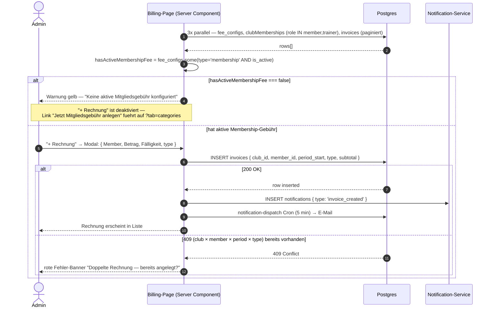

## 📊 Übersicht der Schlüssel-Flows

### 1–8 · End-to-End-Patterns

| Flow             | Schlüssel-Routes                                                | Schlüssel-Tabellen                                            | Externe             | Tutorial-Walkthrough                                                                                                                          |
| ---------------- | --------------------------------------------------------------- | ------------------------------------------------------------- | ------------------- | --------------------------------------------------------------------------------------------------------------------------------------------- |
| Buchen           | `POST /api/bookings`                                            | `bookings`, `sessions`, `notifications`                       | –                   | [`member-bookings-and-attendance`](../user/tutorials/member-bookings-and-attendance.md)                                                       |
| Saison-Planung   | `/admin/seasons/[id]/planning/*`, `/api/ai/season-cluster`      | `seasons`, `season_plan_entries`, `seasonal_planning_history` | Gemini              | _(kein dediziertes Tutorial vorhanden)_                                                                                                       |
| Zahlung          | `/api/stripe/checkout`, `/api/webhooks/stripe`                  | `invoices`, `stripe_events`, `subscriptions`                  | Stripe              | [`admin-billing`](../user/tutorials/admin-billing.md)                                                                                         |
| Public-Trial     | `POST /api/public/trial-training`, `PATCH /api/trial-trainings` | `trial_trainings`, `user_club_memberships`                    | Resend              | [`public-trial-booking`](../user/tutorials/public-trial-booking.md) und [`admin-trial-approvals`](../user/tutorials/admin-trial-approvals.md) |
| Mahnwesen        | `/api/cron/overdue-invoices`                                    | `invoices`, `dunning_records`                                 | –                   | [`admin-mahnwesen.md`](../user/tutorials/admin-mahnwesen.md)                                                                                  |
| Smart Court      | `/api/hardware/vendor/*`                                        | `notifications`, smart_court-spezifische                      | Hardware-Vendor     | _(kein dediziertes Tutorial vorhanden)_                                                                                                       |
| Decisions        | `/api/decisions/*`                                              | `decision_proposals`, `decision_votes`                        | –                   | _(kein dediziertes Tutorial vorhanden)_                                                                                                       |
| Admin-Onboarding | `POST /api/owner/invite-admin`                                  | `user_club_memberships`, `auth.users`                         | Resend + Magic-Link | _(kein dediziertes Tutorial vorhanden)_                                                                                                       |

### 9–15 · Tutorial-konkrete Mikro-Flows

| #   | Mikro-Flow                         | Schlüssel-Route                                         | Schlüssel-Tabelle                                 | Tutorial-Walkthrough                                                                                                                 |
| --- | ---------------------------------- | ------------------------------------------------------- | ------------------------------------------------- | ------------------------------------------------------------------------------------------------------------------------------------ |
| 9   | Trainer-Verfügbarkeit Save         | `GET/POST/DELETE /api/trainer/availability`             | `trainer_availability`                            | [`trainer-availability`](../user/tutorials/trainer-availability.md#schritt-3--speichern)                                             |
| 10  | Trainer "Auf alle Wochen im Monat" | `POST x N /api/trainer/availability`                    | `trainer_availability`                            | [`trainer-availability`](../user/tutorials/trainer-availability.md#bulk-aktion-auf-alle-wochen-im-monat-anwenden)                    |
| 11  | Trainer-RSVP Check-in              | `POST /api/attendance-records`                          | `attendance_records`                              | [`trainer-sessions-and-checkin`](../user/tutorials/trainer-sessions-and-checkin.md)                                                  |
| 12  | 2FA Enroll → Verify                | `supabase.auth.mfa.*` (Client-SDK)                      | `auth.mfa_factors`                                | [`member-profile-security-billing`](../user/tutorials/member-profile-security-billing.md#32-zwei-faktor-authentifizierung-2fa--totp) |
| 13  | Account löschen → Anonymize        | `DELETE /api/user/delete` → `anonymize.service.ts`      | `users` (anonymized), `audit_logs`                | [`member-profile-security-billing`](../user/tutorials/member-profile-security-billing.md#33-konto-löschen-gefahrenzone)              |
| 14  | Trial → Member Convert             | `POST /api/admin/trial-training/[id]/convert-to-member` | `user_club_memberships`, `auth.users`             | [`admin-trial-approvals`](../user/tutorials/admin-trial-approvals.md#schritt-5--zu-mitglied-konvertieren-nach-geplanter-session)     |
| 15  | Rechnung-Erstellung mit Fee-Gate   | `POST /api/invoices` (vorher Fee-Check)                 | `invoices`, `fee_configurations`, `notifications` | [`admin-billing`](../user/tutorials/admin-billing.md#b-gelbe-warnung-oben-auf-der-page)                                              |

**Map-of-Content:** Diagramme 1–8 zeigen die **Big-Picture-Architektur**; Diagramme 9–15 zeigen die **konkreten Mikro-Strecken**, die ein User tatsächlich durchläuft. Tutorials sind der ausführliche Walkthrough, Diagramme sind das visuelle Skelett.

**Tutorial-Coverage-Policy:** `–` war zuvor als Platzhalter etabliert. Aktuell existieren 10 Tutorials (9 User-facing + 1 Plattform). Wo ein Walkthrough existiert, wird er in Spalte 5 verlinkt; wo keiner existiert, steht explizit `_(kein dediziertes Tutorial vorhanden)_`. Die 10 Tutorials decken primär User-facing Flows (Public Trial / Member-Buchungen / Trainer-Sessions / Admin-Trial-Approvals / Admin-Billing) plus Mahnwesen (Plattform-Cron). Plattform- und IoT-Flows (Saison-Planung, Smart Court, Decisions, Admin-Onboarding) sind als Diagramme dokumentiert, aber nicht in einem Schritt-für-Schritt-Walkthrough ausgearbeitet. Erst bei Bedarf gezielt erstellen — siehe [Tutorial-Index](../user/tutorials/README.md).

## 📚 Verwandte Kapitel

### Handbuch-Struktur

- [`README.md`](../README.md) — Handbuch-Index + Architektur-Übersicht
- [`architecture.md`](./architecture.md) — wie die Schichten zusammenspielen
- [`notifications.md`](./notifications.md) — Notification-Service im Detail
- [`stripe-integration.md`](./stripe-integration.md) — Webhook-Idempotenz
- [`background-jobs.md`](./background-jobs.md) — Cron-Worker-Pattern
- [`data-model.md`](./data-model.md) — Tabellen-Übersicht (88+ Tabellen)

### Schritt-für-Schritt-Tutorials (indexiert nach Rolle)

- [`tutorials/README.md`](../user/tutorials/README.md) — Index aller 9 Walk-throughs
- **Mitglied**: [`getting-started`](../user/tutorials/member-getting-started.md) · [`bookings-and-attendance`](../user/tutorials/member-bookings-and-attendance.md) · [`profile-security-billing`](../user/tutorials/member-profile-security-billing.md)
- **Trainer**: [`availability`](../user/tutorials/trainer-availability.md) · [`sessions-and-checkin`](../user/tutorials/trainer-sessions-and-checkin.md)
- **Admin**: [`trial-approvals`](../user/tutorials/admin-trial-approvals.md) · [`members-and-courts`](../user/tutorials/admin-members-and-courts.md) · [`billing`](../user/tutorials/admin-billing.md)
- **Public**: [`trial-booking`](../user/tutorials/public-trial-booking.md)
